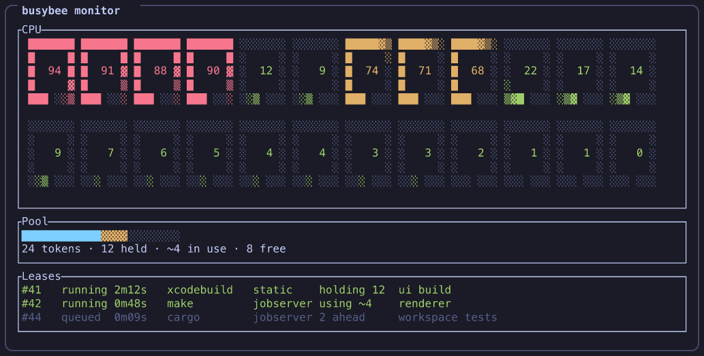

# busybee [](https://github.com/githappens/busybee/actions/workflows/ci.yml)

A runner that shares one machine's cores between resource-heavy tasks, with a
live CPU + queue TUI.



## Why

Running several agentic dev sessions in parallel is great — until they all fire
off a `cmake --build`, `cargo build`, or big test suite at once. Saturating
every core means every session gets slower, agents time out, and the fans
scream. Serialising them fixes the contention but wastes the machine: one
`cargo build` rarely keeps every core busy. Prefix the heavy command with
`busybee --` and it runs with a share of the machine instead of a claim on all
of it — full stdout and exit-code passthrough, as if you had typed it directly.

## How it works

**One pool of tokens.** A daemon (`bzbd`) owns a single machine-wide GNU make
[jobserver](https://www.gnu.org/software/make/manual/html_node/POSIX-Jobserver.html)
fifo holding `pool_size` tokens, one per logical core by default. Every build
draws its parallelism from that one pool, so the machine runs `pool_size` jobs
plus the one untokened job each admitted task starts — not a pool per session.

**Two ways to join it.** Tools that speak the jobserver protocol — make ≥ 4.4,
ninja ≥ 1.13, cargo, and `cmake --build` through those generators — get
`MAKEFLAGS` pointed at the fifo and take a token per compile job, giving them
back as jobs finish. That is the **jobserver** class. Tools that cannot speak it
get **static** treatment: busybee pulls `n` tokens out of the same fifo on their
behalf, holds them for the task's lifetime, and tells the tool `n` through the
one knob it has (`GOMAXPROCS`, `-jobs`, …). Anything unrecognised is **none**:
static, sized to the whole pool, so it runs alone.

**Alone you get the machine; together you share it.** A single jobserver build
drains every token and uses all cores. When a second one starts, the two
interleave token by token; when one finishes, the other grows back within a
compile unit. No daemon decision is involved. The caveat is static tasks: their
tools read the core count once at startup, so a static task is **locked at the
number it was admitted with** until it exits, even if the machine empties out.
(Injection lands with [#8](https://github.com/githappens/busybee/issues/8);
until then every task is admitted `none`, `--class` and `--cores` only earn a
notice, and busybee says as much on stderr.)

## Usage

```bash
busybee -- cmake --build build --target MyProject
busybee --name "backend tests" -- cargo test --workspace
busybee --class static --cores 4 -- ./scripts/bench.sh
busybee --detach -- long-running-thing     # enqueue and return immediately
busybee cancel 7                            # end a detached lease
busybee monitor                             # live TUI
busybee status                              # one-shot pool + queue view
busybee status --json                       # the same, for scripts and agents
```

`busybee -- <cmd>` blocks until the pool has room, then runs the command in the
current directory and exits with its exit code. It reports what it got on
stderr, one line each:

```
busybee: queued (2 ahead)
busybee: running — cmake, jobserver, sharing 18-token pool with 1 other task
busybee: command exited 0 (elapsed 2m14s)
```

`--class jobserver|static|none` overrides the class busybee infers, and
`--cores N` sets how many cores a static task asks for (ignored, with a notice,
for a jobserver task). `busybee status` prints the pool and one row per lease,
`--json` prints the daemon's reply as a single line, and `busybee monitor` shows
the same live under the CPU gauges. Neither starts a daemon: with none running
`status` reports an idle pool on stderr and exits 0 with stdout empty, unless the
daemon died leaving tasks behind.

Press `q` in the monitor to quit. `Ctrl-C` while blocked cancels: the queued or
running task is killed and busybee exits 130. `--detach` prints a lease id and
returns, and the task outlives the client, so `Ctrl-C` cannot reach it —
`busybee cancel <id>` is the only way to end one early.

## Tools

| tool | class | how it gets its share |
|---|---|---|
| `make`, `gmake` | jobserver | `MAKEFLAGS=--jobserver-auth=fifo:…` |
| `ninja` | jobserver | same |
| `cmake --build` | jobserver | same, via the generator; `CMAKE_BUILD_PARALLEL_LEVEL` is removed |
| `cargo` | jobserver | `MAKEFLAGS`, `CARGO_MAKEFLAGS`, `RUST_TEST_THREADS`; the `rustc` processes cargo spawns take tokens through it |
| `xcodebuild` | static | argv `-jobs max(1, N−1)`, since `-jobs N` runs N+1 compiles; a one-token share still allows two. Your own `-jobs` is left alone, and the lease goes on holding its share, so the tool oversubscribes it |
| `go` | static | `GOMAXPROCS=N` |
| `ctest` | static | `CTEST_PARALLEL_LEVEL=N` |
| `pytest` | static | `PYTEST_ADDOPTS` gains `-n N` |
| `docker build`, everything else | none | nothing injected — the task runs alone |

**Matched, not checked.** busybee classifies on the executable name alone. The
jobserver rows assume make ≥ 4.4, ninja ≥ 1.13 and a Make or Ninja generator
under `cmake --build`; nothing verifies it, so an older tool is still admitted
as jobserver, ignores the fifo and runs at its own default. Your own count wins
too: `make -j8`, `cargo build -j8`, `cmake --build … --parallel 8` keep your
number. busybee still points `MAKEFLAGS` at the fifo and prints a notice, but
your flag overrides it, and a jobserver task holds no tokens either way — so
that build runs beside the pool rather than inside it.

**none** is the honest default for a command busybee cannot reason about: a
benchmark, a render, an opaque `sh -c '…'`. It takes the whole pool and
everything else waits — safe but wasteful, so name a better class when you can.

[#8](https://github.com/githappens/busybee/issues/8) adds `BUSYBEE_CLASS` and
`BUSYBEE_CORES` to every task's environment — the remedy for a tool hidden
inside a script. Until it lands the script sees neither, so keep the fallback:

```bash
busybee --class static --cores 4 -- ./scripts/bench.sh
# and inside bench.sh:  ./mytool --threads "${BUSYBEE_CORES:-4}"
```

## Configuration

Optional. With no file, busybee runs on the defaults below.

```bash
busybee config show      # the effective configuration (defaults merged), as TOML
busybee config reload    # make a running bzbd re-read the file (same as SIGHUP)
```

It lives at `busybee/config.toml` under `$XDG_CONFIG_HOME`, or under
`~/.config` when that is unset; `BUSYBEE_CONFIG` (absolute) names another file.

```toml
pool_size = 18            # default: logical cores
max_concurrent = 4
drain_deadline_ms = 2000

[defaults]
static = "fair"           # or a fixed core count

[overrides]               # add or replace classification rows without a release
"./build.sh" = { class = "jobserver" }
"my-bench"   = { class = "none" }
"mytool"     = { class = "static", env = { MYTOOL_THREADS = "{cores}" } }
```

| key | type | default | meaning |
|---|---|---|---|
| `pool_size` | integer 1–4096 | logical cores | Tokens in the shared CPU pool. |
| `max_concurrent` | integer ≥ 1 | 4 | Tasks admitted at once, whatever their size. |
| `drain_deadline_ms` | integer 100–60000 | 2000 | How long a static task waits for its tokens before starting with what it collected. |
| `defaults.static` | `"fair"` or integer ≥ 1 | `"fair"` | Cores such a task asks for: `"fair"` is its share of the pool at the moment it starts. |
| `overrides.<tool>` | table | none | One classification row, replacing the built-in one for that tool outright. |
| `overrides.<tool>.class` | `"jobserver"`, `"static"` or `"none"` | required | How the tool shares the pool. |
| `overrides.<tool>.env` | table of strings | empty | Variables to set for the task, on top of what the class injects. Values may contain `{cores}`, `{cores-1}` and `{fifo}`, and nothing else. A variable busybee owns — `MAKEFLAGS` and `CARGO_MAKEFLAGS` on a jobserver row, `BUSYBEE_CLASS`/`BUSYBEE_CORES` on every row — keeps busybee's value, and the row's is dropped with a notice. |

An override key is matched against the tool's basename, so `"./build.sh"` and
`"build.sh"` name the same row (two keys that collapse to one are an error).
A row keeps one thing from the built-in it replaces — the flags that tool
spells parallelism with, which the file cannot say: `cargo -j8` still earns its
notice.

A file that does not parse, names a key busybee does not read, or carries a
value out of range is refused whole, with the line to fix: nothing is applied
in part. `bzbd` then refuses to start, and a reload keeps the configuration it
was already running on.

## Install

The client is two executables — `busybee` (the full name) and `bzb` (a short
alias). It auto-starts the broker and [pueue](https://github.com/Nukesor/pueue)'s
`pueued` on demand but bundles neither, so both must be installed: `bzbd` either
beside `bzb` or on your `PATH`, `pueued` on your `PATH`.

```bash
brew install githappens/tap/busybee   # macOS arm64
brew install pueue                    # prerequisite
```

```bash
cargo install bzb bzbd                # any Rust target
nix profile add nixpkgs#pueue         # prerequisite
```

From source: `./scripts/buildanddeploy.sh` installs both into your nix profile.

## Use with agentic dev workflows

busybee exists to fix a specific problem: multiple coding-agent sessions on one
machine, each firing off `cargo build` or `cmake --build` whenever it feels like
it. You don't want them to stop building, you want them to share the cores.

Teach every session in one place by dropping a `CLAUDE.md` (or `AGENTS.md`,
`.cursorrules`, whatever your tool looks for) at the root of your work tree,
saying roughly this:

    ## Route heavy commands through `busybee`

    Several agent sessions share this machine. Anything that eats cores —
    compilation, linking, large test suites — goes through `busybee`, which
    hands it a share of one machine-wide CPU pool. Trivial one-shots (`git`,
    `rg`, `cargo fmt`) do not need it.

    Wrap the build tool itself, never a shell string. busybee reads the argv
    to decide how the tool joins the pool, and `sh -c '…'` is opaque to it,
    so it runs exclusive and makes everyone else wait:

        busybee -- cargo test --workspace          # good
        busybee -- sh -c 'cargo test --workspace'  # runs alone, avoid

    For a script busybee cannot see into, say what it needs, and have the
    script pass `${BUSYBEE_CORES:-4}` to whatever tool it runs:

        busybee --class static --cores 4 -- ./scripts/bench.sh

    Read the `busybee: running — …` line on stderr: it names the tool, the
    class, and the cores you were given. `static, holding 4/18` means four
    cores for the whole run, so size the work to that rather than assuming
    the machine is yours.

    To see what the machine is doing, use `busybee status --json` — one JSON
    line with the pool and every lease. Do not query pueue directly; busybee
    owns that queue.

## Architecture

```
busybee (client)  ──unix socket──▶  bzbd (broker)  ──pueue-lib──▶  pueued (supervisor, logs)
                                      │ owns: fifo token pool, queue, leases, admission
                                      │ submits admitted tasks with start_immediately
                                      └ group `busybee` at parallel_tasks = 0
```

[pueue](https://github.com/Nukesor/pueue) keeps what it is good at — spawning,
process groups, log capture, persistence — while `bzbd` decides what runs.
[`docs/design/bzbd.md`](docs/design/bzbd.md) is the specification, tracked in
[#2](https://github.com/githappens/busybee/issues/2), and
[#21](https://github.com/githappens/busybee/issues/21) will add the worked
example: `crates/bzb/tests/e2e_pool.rs`, two jobserver builds and a static task.

## Not yet

- [#15](https://github.com/githappens/busybee/issues/15) ambient mode: a global
  `MAKEFLAGS` so builds you did not wrap join the pool too.
- [#16](https://github.com/githappens/busybee/issues/16) RAM-aware admission,
  reusing the same lease machinery.
- [#17](https://github.com/githappens/busybee/issues/17) classification rows for
  `swift build`, jest/vitest, bazel, gradle, msbuild.
- [#18](https://github.com/githappens/busybee/issues/18) letting a static task
  grow back when the pool frees up.

## License

MIT OR Apache-2.0.
